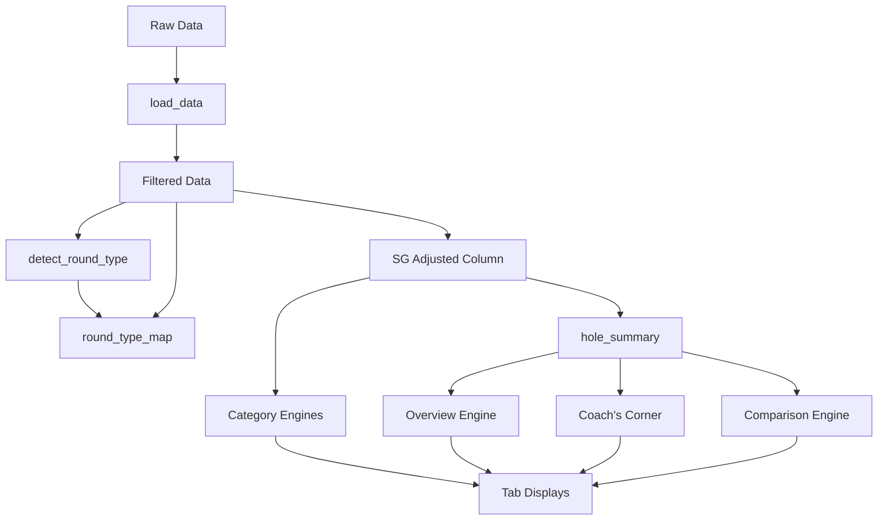

# 9-Hole Round Strokes Gained Normalization Plan

## Overview

This plan documents the implementation of Strokes Gained (SG) analysis that properly handles both 9-hole and 18-hole rounds by normalizing 9-hole rounds to 18-hole equivalents through doubling their SG total.

## Requirements Summary

1. **Round Detection**: 9-hole rounds identified by counting holes per round (≤9 holes = 9-hole, >9 holes = 18-hole)
2. **Normalization**: Double the SG total for 9-hole rounds to create 18-hole equivalents
3. **Display**: Only show adjusted values in aggregate statistics
4. **Transparency**: Clearly indicate which rounds have been adjusted
5. **Data Integrity**: Maintain per-hole SG data while providing accurate full-round comparisons

## Files to Modify

| File | Purpose |
|------|---------|
| `engines/helpers.py` | Add round type detection helper function |
| `app.py` | Add round type metadata to filtered data |
| `engines/overview.py` | Update SG calculations for adjusted totals |
| `engines/driving.py` | Update per-round metrics |
| `engines/approach.py` | Update per-round metrics |
| `engines/short_game.py` | Update per-round metrics |
| `engines/putting.py` | Update per-round metrics |
| `engines/coachs_corner.py` | Update mental metrics |
| `engines/comparison.py` | Update comparison logic |
| `tabs/strokes_gained.py` | Update display with adjusted metrics |
| `CALCULATIONS.md` | Document the normalization logic |

## Implementation Steps

### Step 1: Add Round Type Detection Helper

**File**: `engines/helpers.py`

Create a function to classify rounds as 9-hole or 18-hole:

```python
def detect_round_type(df):
    """
    Detect whether each round is a 9-hole or 18-hole round.
    
    Returns:
        DataFrame with 'round_type' column ('9-hole' or '18-hole')
        and 'sg_multiplier' column (2.0 for 9-hole, 1.0 for 18-hole)
    """
    hole_counts = df.groupby('Round ID')['Hole'].nunique()
    
    round_types = {}
    for rid, count in hole_counts.items():
        if count <= 9:
            round_types[rid] = {'round_type': '9-hole', 'sg_multiplier': 2.0}
        else:
            round_types[rid] = {'round_type': '18-hole', 'sg_multiplier': 1.0}
    
    return round_types
```

### Step 2: Update Data Processing Pipeline

**File**: `app.py`

After filtering data, add round type metadata:

```python
# Add round type detection
from engines.helpers import detect_round_type

round_type_map = detect_round_type(filtered_df)
filtered_df['round_type'] = filtered_df['Round ID'].map(
    lambda x: round_type_map[x]['round_type']
)
filtered_df['sg_multiplier'] = filtered_df['Round ID'].map(
    lambda x: round_type_map[x]['sg_multiplier']
)

# Calculate adjusted SG at row level
filtered_df['SG Adjusted'] = filtered_df['Strokes Gained'] * filtered_df['sg_multiplier']
```

### Step 3: Update SG Aggregation Functions

**File**: `engines/overview.py`

Key changes to [`overview_engine()`](engines/overview.py:9):

```python
def overview_engine(df, hole_summary, ...):
    # Use adjusted SG for totals
    total_sg = df['SG Adjusted'].sum()  # Changed from df['Strokes Gained'].sum()
    
    # Calculate effective rounds (9-hole rounds count as 2 for per-round metrics)
    num_rounds_18equiv = df.groupby('Round ID')['sg_multiplier'].first().sum()
    
    # SG per round uses 18-hole equivalent
    sg_per_round = total_sg / num_rounds_18equiv if num_rounds_18equiv > 0 else 0
```

### Step 4: Update Per-Round Metrics in All Engines

The following pattern applies to all engines that calculate per-round metrics:

**Pattern for driving.py, approach.py, short_game.py, putting.py**:

```python
def build_driving_results(df, num_rounds, hole_summary):
    # Old: num_rounds = df['Round ID'].nunique()
    # New: Use 18-hole equivalent rounds
    num_rounds_18equiv = df.groupby('Round ID')['sg_multiplier'].first().sum()
    
    # All per-round calculations use num_rounds_18equiv
    sg_per_round = total_sg / num_rounds_18equiv
```

### Step 5: Update Hole Summary Engine

**File**: `engines/hole_summary.py`

```python
def build_hole_summary(filtered_df):
    # Add round type and multiplier to hole summary
    round_type_map = filtered_df.groupby('Round ID').agg({
        'round_type': 'first',
        'sg_multiplier': 'first'
    }).reset_index()
    
    hole_summary = hole_summary.merge(round_type_map, on='Round ID', how='left')
    
    # Add adjusted total SG
    hole_summary['total_sg_adjusted'] = hole_summary['total_sg'] * hole_summary['sg_multiplier']
    
    return hole_summary
```

### Step 6: Update Strokes Gained Tab Display

**File**: `tabs/strokes_gained.py`

Update summary cards and metrics:

```python
def strokes_gained_tab(filtered_df, hole_summary, num_rounds, ...):
    # Use adjusted SG
    total_sg_adjusted = filtered_df['SG Adjusted'].sum()
    
    # Calculate 18-hole equivalent round count
    num_rounds_18equiv = filtered_df.groupby('Round ID')['sg_multiplier'].first().sum()
    
    # Display adjusted metrics
    summary_metrics = [
        ('SG Total (Adj)', total_sg_adjusted),
        ('SG/Round (18-hole equiv)', total_sg_adjusted / num_rounds_18equiv),
        ...
    ]
```

### Step 7: Add Visual Indicator for Adjusted Rounds

**File**: `tabs/strokes_gained.py` (in SG trend section)

```python
# Show which rounds were adjusted
sg_trend['adjusted'] = sg_trend['Round ID'].map(
    lambda rid: filtered_df[filtered_df['Round ID'] == rid]['sg_multiplier'].iloc[0] == 2.0
)

# Add marker to adjusted rounds in chart
for i, row in sg_trend.iterrows():
    if row['adjusted']:
        fig.add_annotation(...)
```

### Step 8: Update Coach's Corner Mental Metrics

**File**: `engines/coachs_corner.py`

Mental metrics should use adjusted SG totals:

```python
def build_coachs_corner(..., tiger5_root_causes=None):
    # Use adjusted SG for pressure/early/late round analysis
    hole_summary['total_sg_adj'] = hole_summary['total_sg'] * hole_summary['sg_multiplier']
    
    # Recalculate all mental metrics with adjusted SG
    ...
```

### Step 9: Update Comparison Engine

**File**: `engines/comparison.py`

Ensure fair comparisons between 9-hole and 18-hole rounds:

```python
def comparison_engine(df, hole_summary, ...):
    # Calculate adjusted totals for each comparison group
    group_stats['total_sg_adjusted'] = group_stats['total_sg'] * group_stats['sg_multiplier']
    
    # Use adjusted SG for all comparisons
    ...
```

## Mermaid Diagram: Data Flow



## Affected Calculations

### Metrics That Need Adjustment

| Metric | Current Calculation | Adjusted Calculation |
|--------|-------------------|---------------------|
| Total SG | sum(Strokes Gained) | sum(SG Adjusted) |
| SG per Round | Total SG / num_rounds | Total SG / num_rounds_18equiv |
| SG by Category | sum(SG by type) | sum(SG Adjusted by type) |
| Scoring Average | mean(Hole Score) | Unchanged |
| Hole-by-Hole SG | sum(SG per hole) | Unchanged (per-hole display) |
| SG Trend by Round | SG per round | Adjusted SG per round |

### Metrics That Remain Unchanged

- Per-hole SG data (display purposes)
- Shot-level detail
- Hole Score and scoring outcomes
- Fairway %, GIR %, etc. (not SG-based)

## Testing Checklist

- [ ] Verify 9-hole rounds are correctly detected (≤9 holes)
- [ ] Confirm SG is doubled for 9-hole rounds in totals
- [ ] Verify per-round metrics use 18-hole equivalent denominator
- [ ] Check that 18-hole rounds remain unchanged
- [ ] Validate hole-by-hole SG display shows original values
- [ ] Confirm adjusted rounds are visually indicated in trend charts
- [ ] Test comparison engine with mixed 9-hole and 18-hole rounds

## Rollout Sequence

1. Add helper function to `helpers.py`
2. Update `app.py` with round type detection
3. Update `hole_summary.py` for adjusted totals
4. Update `overview.py` for core SG metrics
5. Update all category engines (driving, approach, short_game, putting)
6. Update `coachs_corner.py` for mental metrics
7. Update `comparison.py` for fair comparisons
8. Update `strokes_gained.py` tab display
9. Update `CALCULATIONS.md` documentation

## Success Criteria

- 9-hole rounds contribute proportionally to 18-hole rounds in aggregate SG
- Per-hole SG data remains accurate and unmodified
- Users can identify which rounds were adjusted
- All per-round metrics use 18-hole equivalent denominators
- No regression in 18-hole round calculations
