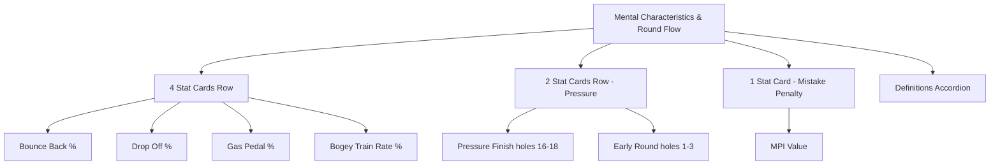
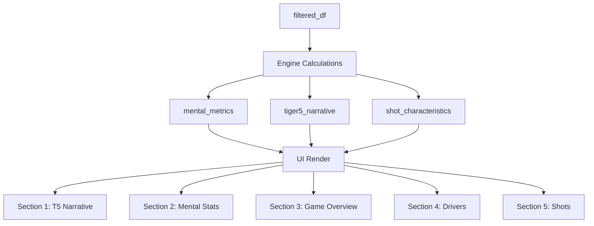

# Coach's Corner Overhaul - Architectural Plan

## Overview
Complete overhaul of the Coach's Corner tab with 5 main sections:
1. **Tiger 5 Root Causes** - Dynamic narrative summary
2. **Mental Characteristics & Round Flow** - New stat cards with definitions
3. **Game Overview** - Two-column Strength/Weakness analysis
4. **Performance Drivers** - "Impress Me" insight section
5. **Shot Characteristics** - Collapsible shot-level breakdown

---

## Section 1: Tiger 5 Root Causes Narrative

### Data Source
Uses `tiger5_results` and `build_tiger5_root_cause()` from [`engines/tiger5.py`](engines/tiger5.py:240)

### Implementation
```python
def _generate_tiger5_narrative(shot_type_counts, detail_by_type):
    """Generate bullet point narrative from root cause analysis."""
    lines = []
    
    # Sort causes by frequency
    sorted_causes = sorted(shot_type_counts.items(), key=lambda x: x[1], reverse=True)
    
    # Main root cause bullet
    top_cause = sorted_causes[0]
    lines.append(f"**Primary Challenge**: {top_cause[0]} contributes to {top_cause[1]} Tiger 5 fails")
    
    # Secondary causes
    if len(sorted_causes) > 1:
        second = sorted_causes[1]
        lines.append(f"**Secondary Issue**: {second[0]} accounts for {second[1]} failures")
    
    # Total context
    total_fails = sum(shot_type_counts.values())
    lines.append(f"**Total Impact**: {total_fails} Tiger 5 failures across all categories")
    
    return lines
```

### UI Display
- Styled bullet points using existing `section_header`
- Highlighted metrics with color coding (red for high failure areas)

---

## Section 2: Mental Characteristics & Round Flow

### New Metrics to Add

#### A. Bounce Back Rate (Existing, needs verification)
```python
def _bounce_back_rate(hole_summary):
    """Bounce Back: Bogey+ on h, then birdie+ on h+1."""
    opp, success = 0, 0
    for rid, round_df in hole_summary.groupby('Round ID'):
        sorted_df = round_df.sort_values('Hole').reset_index(drop=True)
        for i in range(len(sorted_df) - 1):
            current_score = sorted_df.iloc[i]['Hole Score']
            current_par = sorted_df.iloc[i]['Par']
            next_score = sorted_df.iloc[i + 1]['Hole Score']
            next_par = sorted_df.iloc[i + 1]['Par']
            
            # Opportunity: bogey or worse on hole h
            if current_score >= current_par + 1:
                opp += 1
                # Success: par or better on hole h+1
                if next_score <= next_par:
                    success += 1
    
    rate = success / opp * 100 if opp > 0 else 0.0
    return {"rate": rate, "opportunities": opp, "successes": success}
```

#### B. Drop-Off Rate (New Definition)
```python
def _drop_off_rate(hole_summary):
    """
    Drop-Off Opportunity: Bogey or worse on hole h
    Drop-Off Event: Bogey or worse again on hole h+1
    """
    opp, events = 0, 0
    for rid, round_df in hole_summary.groupby('Round ID'):
        sorted_df = round_df.sort_values('Hole').reset_index(drop=True)
        for i in range(len(sorted_df) - 1):
            prev_score = sorted_df.iloc[i]['Hole Score']
            prev_par = sorted_df.iloc[i]['Par']
            curr_score = sorted_df.iloc[i + 1]['Hole Score']
            curr_par = sorted_df.iloc[i + 1]['Par']
            
            # Opportunity: bogey or worse on previous hole
            if prev_score >= prev_par + 1:
                opp += 1
                # Event: bogey or worse on current hole
                if curr_score >= curr_par + 1:
                    events += 1
    
    rate = events / opp * 100 if opp > 0 else 0.0
    return {"rate": rate, "opportunities": opp, "events": events}
```

#### C. Gas Pedal Rate (New Definition)
```python
def _gas_pedal_rate(hole_summary):
    """
    Gas Pedal: Birdie+ (score_to_par <= -1) on h, followed by birdie+ on h+1.
    """
    opp, success = 0, 0
    for rid, round_df in hole_summary.groupby('Round ID'):
        sorted_df = round_df.sort_values('Hole').reset_index(drop=True)
        for i in range(len(sorted_df) - 1):
            prev_score = sorted_df.iloc[i]['Hole Score']
            prev_par = sorted_df.iloc[i]['Par']
            curr_score = sorted_df.iloc[i + 1]['Hole Score']
            curr_par = sorted_df.iloc[i + 1]['Par']
            
            # Opportunity: birdie or better on previous hole
            if prev_score <= prev_par - 1:
                opp += 1
                # Success: birdie or better on current hole
                if curr_score <= curr_par - 1:
                    success += 1
    
    rate = success / opp * 100 if opp > 0 else 0.0
    return {"rate": rate, "opportunities": opp, "successes": success}
```

#### D. Bogey Train Rate (BTR) - New Calculation
```python
def _bogey_train_rate(hole_summary):
    """
    BTR = bogey_train_holes / bogey_plus_holes
    Bogey train: 2+ consecutive holes with score_to_par >= +1
    """
    bogey_plus_holes = 0
    bogey_train_holes = 0
    all_bogey_trains = []
    
    for rid, round_df in hole_summary.groupby('Round ID'):
        sorted_df = round_df.sort_values('Hole').reset_index(drop=True)
        
        current_train = 0
        for i, row in sorted_df.iterrows():
            score = row['Hole Score']
            par = row['Par']
            
            if score >= par + 1:  # bogey or worse
                bogey_plus_holes += 1
                current_train += 1
            else:
                if current_train >= 2:
                    bogey_train_holes += current_train
                    all_bogey_trains.append(current_train)
                current_train = 0
        
        # End of round check
        if current_train >= 2:
            bogey_train_holes += current_train
            all_bogey_trains.append(current_train)
    
    btr = bogey_train_holes / bogey_plus_holes * 100 if bogey_plus_holes > 0 else 0.0
    return {
        "btr": btr,
        "bogey_plus_holes": bogey_plus_holes,
        "bogey_train_holes": bogey_train_holes,
        "trains": all_bogey_trains,
        "longest_train": max(all_bogey_trains) if all_bogey_trains else 0
    }
```

#### E. Pressure Finish Performance
```python
def _pressure_finish_performance(hole_summary, filtered_df):
    """
    Score relative to par on holes 16-18 vs baseline.
    SG per hole on holes 16-18 vs baseline SG per hole.
    """
    # Holes 16-18
    finishing = hole_summary[hole_summary['Hole'].isin([16, 17, 18])]
    finish_score_to_par = (finishing['Hole Score'] - finishing['Par']).sum()
    finish_holes = len(finishing)
    
    # Baseline (all holes)
    baseline_score_to_par = (hole_summary['Hole Score'] - hole_summary['Par']).sum()
    baseline_holes = len(hole_summary)
    
    # SG calculation for holes 16-18
    finish_shots = filtered_df[filtered_df['Hole'].isin([16, 17, 18])]
    finish_sg = pd.to_numeric(finish_shots['Strokes Gained'], errors='coerce').sum()
    
    # Baseline SG
    baseline_sg = pd.to_numeric(filtered_df['Strokes Gained'], errors='coerce').sum()
    
    # Per-hole calculations
    finish_sg_per_hole = finish_sg / finish_holes if finish_holes > 0 else 0
    baseline_sg_per_hole = baseline_sg / baseline_holes if baseline_holes > 0 else 0
    
    return {
        "finish_score_to_par": finish_score_to_par,
        "finish_holes": finish_holes,
        "finish_sg": finish_sg,
        "finish_sg_per_hole": finish_sg_per_hole,
        "baseline_sg_per_hole": baseline_sg_per_hole,
        "sg_vs_baseline": finish_sg_per_hole - baseline_sg_per_hole
    }
```

#### F. Early Round Composure
```python
def _early_round_composure(hole_summary, filtered_df):
    """
    Score relative to par on holes 1-3 vs baseline.
    SG per hole on holes 1-3 vs baseline.
    """
    # Holes 1-3
    early = hole_summary[hole_summary['Hole'].isin([1, 2, 3])]
    early_score_to_par = (early['Hole Score'] - early['Par']).sum()
    early_holes = len(early)
    
    # SG calculation for holes 1-3
    early_shots = filtered_df[filtered_df['Hole'].isin([1, 2, 3])]
    early_sg = pd.to_numeric(early_shots['Strokes Gained'], errors='coerce').sum()
    
    # Baseline SG
    baseline_sg = pd.to_numeric(filtered_df['Strokes Gained'], errors='coerce').sum()
    baseline_holes = len(hole_summary)
    
    early_sg_per_hole = early_sg / early_holes if early_holes > 0 else 0
    baseline_sg_per_hole = baseline_sg / baseline_holes if baseline_holes > 0 else 0
    
    return {
        "early_score_to_par": early_score_to_par,
        "early_holes": early_holes,
        "early_sg": early_sg,
        "early_sg_per_hole": early_sg_per_hole,
        "baseline_sg_per_hole": baseline_sg_per_hole,
        "sg_vs_baseline": early_sg_per_hole - baseline_sg_per_hole
    }
```

#### G. Mistake Penalty Index
```python
def _mistake_penalty_index(hole_summary, tiger5_results):
    """
    Score relative to par on Tiger 5 fail holes vs baseline scoring on clean holes.
    """
    # Get T5 fail holes
    t5_fail_holes = set()
    tiger5_names = ['3 Putts', 'Double Bogey', 'Par 5 Bogey', 'Missed Green', '125yd Bogey']
    
    for name in tiger5_names:
        info = tiger5_results.get(name, {})
        if isinstance(info, dict) and 'detail_holes' in info:
            detail = info['detail_holes']
            if not detail.empty:
                for _, row in detail.iterrows():
                    t5_fail_holes.add((row['Round ID'], row['Hole']))
    
    # Calculate on T5 fail holes
    fail_scores = hole_summary[
        hole_summary.apply(lambda x: (x['Round ID'], x['Hole']) in t5_fail_holes, axis=1)
    ]
    fail_score_to_par = (fail_scores['Hole Score'] - fail_scores['Par']).sum()
    fail_holes = len(fail_scores)
    
    # Clean holes
    clean_holes = hole_summary[
        ~hole_summary.apply(lambda x: (x['Round ID'], x['Hole']) in t5_fail_holes, axis=1)
    ]
    clean_score_to_par = (clean_holes['Hole Score'] - clean_holes['Par']).sum()
    clean_holes_count = len(clean_holes)
    
    # Per-hole scoring
    fail_per_hole = fail_score_to_par / fail_holes if fail_holes > 0 else 0
    clean_per_hole = clean_score_to_par / clean_holes_count if clean_holes_count > 0 else 0
    
    return {
        "fail_score_to_par": fail_score_to_par,
        "fail_holes": fail_holes,
        "clean_score_to_par": clean_score_to_par,
        "clean_holes": clean_holes_count,
        "fail_per_hole": fail_per_hole,
        "clean_per_hole": clean_per_hole,
        "penalty_index": fail_per_hole - clean_per_hole
    }
```

### UI Layout - Mental Characteristics Section


---

## Section 3: Game Overview - Dynamic Strength/Weakness Analysis

### Design Philosophy
Section 3 should be **dynamically generated** like the Tiger 5 root cause analysis. Instead of static lists, it should:
1. Analyze actual data patterns
2. Generate narrative explanations for WHY something is a strength/weakness
3. Rank factors by impact on final score
4. Provide context-aware insights

### Dynamic Narrative Generation
```python
def _generate_game_overview_narrative(tiger5_results, sg_summary, 
                                       shot_type_counts, mental_metrics, 
                                       hole_summary):
    """
    Dynamically generate strengths and weaknesses narrative.
    Similar to Tiger 5 root cause analysis - analyzes data and explains patterns.
    """
    strengths = []
    weaknesses = []
    
    # === TIGER 5 HERO CARDS ANALYSIS ===
    t5_analysis = []
    for name, data in tiger5_results.items():
        if isinstance(data, dict) and 'attempts' in data:
            attempts = data['attempts']
            fails = data['fails']
            success_rate = (attempts - fails) / attempts * 100 if attempts > 0 else 0
            t5_analysis.append({
                'category': name,
                'attempts': attempts,
                'fails': fails,
                'success_rate': success_rate
            })
    
    # Sort by success rate
    t5_sorted = sorted(t5_analysis, key=lambda x: x['success_rate'], reverse=True)
    
    # Dynamic strength: Top T5 performance with context
    if t5_sorted:
        best = t5_sorted[0]
        if best['success_rate'] >= 85 and best['attempts'] >= 2:
            strengths.append({
                'type': 'Tiger 5 Hero',
                'title': f"{best['category']} Mastery",
                'detail': f"{best['success_rate']:.0f}% success rate "
                         f"({best['attempts'] - best['fails']}/{best['attempts']} clean)",
                'narrative': f"Your ability to avoid {best['category'].lower()} is exceptional. "
                            f"This discipline prevents big numbers and keeps rounds intact."
            })
        
        # Dynamic weakness: Worst T5 with impact
        worst = t5_sorted[-1]
        if worst['fails'] > 0:
            weaknesses.append({
                'type': 'Tiger 5 Vulnerability',
                'title': f"{worst['category']} Struggle",
                'detail': f"{worst['fails']} failures "
                         f"({worst['success_rate']:.0f}% success rate)",
                'narrative': f"{worst['category']} is costing you strokes. "
                            f"Eliminating just one per round could drop your score by 1-2 strokes."
            })
    
    # === TIGER 5 ROOT CAUSES ANALYSIS ===
    root_sorted = sorted(shot_type_counts.items(), key=lambda x: x[1])
    
    if root_sorted and root_sorted[0][1] > 0:
        best_root = root_sorted[0]  # Lowest failure count = strength
        strengths.append({
            'type': 'Root Cause Strength',
            'title': f"{best_root[0]} Control",
            'detail': f"Only {best_root[1]} Tiger 5 fails originate from {best_root[0].lower()}",
            'narrative': f"You demonstrate excellent discipline in {best_root[0].lower()}, "
                        f"rarely letting it contribute to big mistakes."
        })
    
    if len(root_sorted) > 1 and root_sorted[-1][1] > 0:
        worst_root = root_sorted[-1]  # Highest failure count
        weaknesses.append({
            'type': 'Root Cause Issue',
            'title': f"{worst_root[0]} Reliability",
            'detail': f"{worst_root[1]} Tiger 5 fails linked to {worst_root[0].lower()}",
            'narrative': f"{worst_root[0]} is your primary vulnerability. "
                        f"Focus practice on {worst_root[0].lower()} scenarios."
        })
    
    # === STROKES GAINED ANALYSIS ===
    sg_sorted_positive = [(k, v) for k, v in sg_summary.items() if v > 0]
    sg_sorted_negative = [(k, v) for k, v in sg_summary.items() if v < 0]
    sg_sorted_positive.sort(key=lambda x: x[1], reverse=True)
    sg_sorted_negative.sort(key=lambda x: x[1])
    
    if sg_sorted_positive:
        best_sg = sg_sorted_positive[0]
        strengths.append({
            'type': 'SG Strength',
            'title': f"{best_sg[0]} Excellence",
            'detail': f"+{best_sg[1]:.2f} strokes gained",
            'narrative': f"Your {best_sg[0].lower()} is a true weapon, gaining "
                        f"{best_sg[1]:.2f} strokes on the field."
        })
    
    if sg_sorted_negative:
        worst_sg = sg_sorted_negative[0]
        if worst_sg[1] < -0.3:  # Threshold for concern
            weaknesses.append({
                'type': 'SG Weakness',
                'title': f"{worst_sg[0]} Opportunity",
                'detail': f"{worst_sg[1]:.2f} strokes lost",
                'narrative': f"{worst_sg[0]} is costing you strokes. "
                            f"Improving here could significantly lower your scores."
            })
    
    # === MENTAL METRICS ANALYSIS ===
    if mental_metrics.get('bounce_back_pct', 0) >= 25:
        strengths.append({
            'type': 'Mental Strength',
            'title': 'Resilience',
            'detail': f"{mental_metrics['bounce_back_pct']:.0f}% bounce-back rate",
            'narrative': "After a mistake, you typically respond with quality play. "
                        "This mental resilience prevents small mistakes from becoming big numbers."
        })
    
    if mental_metrics.get('bounce_back_pct', 0) < 15:
        weaknesses.append({
            'type': 'Mental Challenge',
            'title': 'Bounce Back',
            'detail': f"Only {mental_metrics['bounce_back_pct']:.0f}% rate",
            'narrative': "Difficulty recovering after bad holes. "
                        "Focus on reset routines to prevent compounding errors."
        })
    
    return {
        'strengths': strengths,
        'weaknesses': weaknesses
    }
```

### UI Display - Two Columns
```
┌─────────────────────────────────┬─────────────────────────────────┐
│         PLAYER STRENGTH         │        PLAYER WEAKNESS          │
├─────────────────────────────────┼─────────────────────────────────┤
│ [Tiger 5 Hero Card]            │ [Tiger 5 Vulnerability Card]    │
│ • Title bolded                  │ • Title bolded                  │
│ • Detail metric                 │ • Detail metric                 │
│ • Narrative paragraph           │ • Narrative paragraph           │
├─────────────────────────────────┼─────────────────────────────────┤
│ [Root Cause Strength Card]      │ [Root Cause Issue Card]         │
├─────────────────────────────────┼─────────────────────────────────┤
│ [SG Excellence Card]            │ [SG Opportunity Card]           │
├─────────────────────────────────┼─────────────────────────────────┤
│ [Mental Resilience Card]        │ [Mental Challenge Card]         │
└─────────────────────────────────┴─────────────────────────────────┘
```

### Card UI Component
```python
def dynamic_strength_card(strength):
    """Render a dynamic strength card with narrative."""
    st.markdown(f"""
    <div style="background:{WHITE};border-radius:{CARD_RADIUS};
                padding:{CARD_PADDING};margin-bottom:1rem;
                border-left:4px solid {POSITIVE};
                box-shadow:0 1px 4px rgba(0,0,0,0.04);">
        <div style="font-family:{FONT_BODY};font-size:0.6rem;
                    color:{SLATE};text-transform:uppercase;
                    letter-spacing:0.08em;">{strength['type']}</div>
        <div style="font-family:{FONT_HEADING};font-size:1rem;font-weight:600;
                    color:{CHARCOAL};margin:0.5rem 0;">{strength['title']}</div>
        <div style="font-family:{FONT_BODY};font-size:0.85rem;
                    color:{ACCENT_PRIMARY};margin-bottom:0.5rem;">
            {strength['detail']}
        </div>
        <div style="font-family:{FONT_BODY};font-size:0.75rem;
                    color:{SLATE};font-style:italic;">
            {strength['narrative']}
        </div>
    </div>
    """, unsafe_allow_html=True)
```

---

## Section 4: "Impress Me" - Performance Drivers

### Algorithm Design
This section will analyze what drives the player's final score and provide actionable insights.

```python
def _performance_driver_analysis(tiger5_results, sg_summary, mental_metrics, hole_summary):
    """
    Identify top 2-3 drivers of score and provide specific recommendations.
    """
    drivers = []
    
    # Factor 1: Tiger 5 Impact
    t5_fails = sum(
        v.get('fails', 0) for k, v in tiger5_results.items() 
        if isinstance(v, dict) and k not in ['grit_score', 'by_round']
    )
    if t5_fails > 3:
        drivers.append({
            "factor": "Tiger 5 Discipline",
            "impact": "high",
            "detail": f"{t5_fails} Tiger 5 failures costing strokes",
            "recommendation": "Focus on eliminating one T5 mistake per round"
        })
    
    # Factor 2: Mental Flow
    if mental_metrics.get('bounce_back_pct', 0) < 20:
        drivers.append({
            "factor": "Bounce Back Ability",
            "impact": "medium",
            "detail": f"Only {mental_metrics['bounce_back_pct']:.0f}% bounce back rate",
            "recommendation": "Practice reset routines after bad holes"
        })
    
    # Factor 3: Scoring Category
    if sg_summary:
        worst_sg = min(sg_summary.items(), key=lambda x: x[1])
        if worst_sg[1] < -0.5:
            drivers.append({
                "factor": f"{worst_sg[0]} Performance",
                "impact": "high",
                "detail": f"Losing {abs(worst_sg[1]):.2f} strokes in {worst_sg[0]}",
                "recommendation": f"Prioritize {worst_sg[0].lower()} practice sessions"
            })
    
    # Factor 4: Closing Ability
    if mental_metrics.get('finish_sg_per_hole', 0) < mental_metrics.get('baseline_sg_per_hole', 0):
        drivers.append({
            "factor": "Pressure Finish",
            "impact": "medium",
            "detail": "SG drops on holes 16-18 vs baseline",
            "recommendation": "Practice closing scenarios and pressure putts"
        })
    
    return drivers[:3]  # Top 3 drivers
```

### UI Display
- Priority-ranked cards with impact levels (high/medium/low)
- Visual indicator for each driver
- Specific, actionable recommendations

---

## Section 5: Shot Characteristics (Collapsible)

### Categories
1. **Recovery Shots**: Shots from Recovery location
2. **Penalty Shots**: Any shot with Penalty='Yes'
3. **Other Shots**: Any shot not in above categories

### Implementation
```python
def _shot_characteristics(filtered_df):
    """Build shot-level breakdown by characteristics."""
    
    recovery = filtered_df[filtered_df['Starting Location'] == 'Recovery'].copy()
    recovery['Category'] = 'Recovery'
    
    penalty = filtered_df[filtered_df['Penalty'] == 'Yes'].copy()
    penalty['Category'] = 'Penalty'
    
    # Other shots (exclude recovery and penalty)
    other = filtered_df[
        (filtered_df['Starting Location'] != 'Recovery') & 
        (filtered_df['Penalty'] != 'Yes')
    ].copy()
    other['Category'] = 'Other'
    
    return {
        "recovery": _format_shot_table(recovery),
        "penalty": _format_shot_table(penalty),
        "other": _format_shot_table(other)
    }

def _format_shot_table(df):
    """Format shot data for display."""
    if df.empty:
        return pd.DataFrame()
    
    return df[[
        'Hole', 'Shot', 'Shot Type', 'Starting Location', 
        'Starting Distance', 'Ending Location', 'Ending Distance',
        'Strokes Gained'
    ]].copy()
```

---

## Engine Function Updates

### Updated `build_coachs_corner()` Signature
```python
def build_coachs_corner(filtered_df, hole_summary,
                        driving_results, approach_results,
                        short_game_results, putting_results,
                        tiger5_results, grit_score,
                        tiger5_root_causes=None):
    """
    Combine all engines into a single coaching insight package.
    
    Returns:
        {
            # Section 1
            "tiger5_narrative": [...],
            "shot_type_counts": {...},
            
            # Section 2
            "mental_metrics": {
                "bounce_back": {...},
                "drop_off": {...},
                "gas_pedal": {...},
                "bogey_train_rate": {...},
                "pressure_finish": {...},
                "early_round": {...},
                "mistake_penalty": {...}
            },
            
            # Section 3
            "game_overview": {
                "strengths": {...},
                "weaknesses": {...}
            },
            
            # Section 4
            "performance_drivers": [...],
            
            # Section 5
            "shot_characteristics": {...},
            
            # Legacy (for compatibility)
            "coach_summary": "...",
            ...
        }
    """
```

---

## UI Component Updates

### New Component: `definition_block()`
```python
def definition_block(title, definition):
    """Collapsible definition section for stat cards."""
    with st.expander(f"📖 {title} Definition", expanded=False):
        st.markdown(definition)
```

### Updated `premium_stat_card()` 
Add optional `definition` parameter for inline definitions.

---

## Data Flow Diagram


---

## Implementation Priority
1. **Engine Updates**: Add all new metric calculations
2. **Engine Updates**: Create narrative generators
3. **UI Build**: Section 1 and 2 (core metrics)
4. **UI Build**: Section 3 (game overview)
5. **UI Build**: Section 4 (impress me)
6. **UI Build**: Section 5 (shot breakdown)
7. **Testing**: Edge cases and data validation

---

## Files to Modify
- [`engines/coachs_corner.py`](engines/coachs_corner.py) - Engine logic updates
- [`tabs/coachs_corner.py`](tabs/coachs_corner.py) - Complete UI rewrite
- [`ui/components.py`](ui/components.py) - Add definition_block component

---

# PLAN UPDATES - Rev 2

## Update 1: Tiger 5 Root Causes Narrative
**Changes:**
- Remove 4th line (Total Impact summary)
- Add shot-level detail for the worst SG shot on first card
- Only the ACCENT/BORDER color is red (not the whole card)
- Function: `_generate_tiger5_narrative()`

**UI Component:**
```python
def tiger5_root_cause_card(item, show_detail=False):
    """
    Tiger 5 root cause card with red BORDER only.
    White background, red left border accent.
    """
    border_color = NEGATIVE  # Red accent only
    # Card has white background with red left border
```

## Update 2: Mental Characteristics Definitions
**Changes:**
- Combine TWO separate expanders into ONE collapsible section
- Improve styling with better formatting
- Use consistent font matching theme

**UI:**
```python
# Single expander at bottom of Mental Characteristics section
definition_expander(
    "Mental Characteristics Definitions",
    """
    <strong>Round Flow Metrics</strong><br><br>
    <strong>Bounce Back %</strong>: Definition...<br><br>
    <strong>Drop Off %</strong>: Definition...<br><br>
    ...
    """
)
```

## Update 3: Game Overview Weakness Color
**Changes:**
- Change weakness cards from standard green/red to ALWAYS RED
- Use `force_negative=True` for weakness cards

**UI:**
```python
# In render_game_overview()
for item in weaknesses[:4]:
    dynamic_narrative_card(item, is_positive=False, force_negative=True)
```

## Update 4: Performance Drivers (Strokes Gained ONLY)
**Changes:**
- KEEP recommendations (not remove them)
- Use ONLY Strokes Gained data for drivers
- Remove Tiger 5, Mental, Pressure Finish factors

**Algorithm:**
```python
def _generate_performance_drivers(tiger5_results, sg_summary, mental_metrics,
                                   shot_type_counts, hole_summary):
    # ONLY use sg_summary data
    # Get worst SG categories (top 3 by strokes lost)
    # Each driver includes:
    #   - factor: "Driving Performance", "Approach Performance", etc.
    #   - impact_score: 1-3 based on strokes lost
    #   - detail: "Losing X strokes in Driving"
    #   - recommendation: SG-based practice recommendation
    #   - priority: HIGH/MEDIUM/LOW
```

## Update 5: Shot Characteristics Table
**Changes:**
- Remove "Category" column from all tables
- Use standard shot types: `Driving`, `Approach`, `Short Game`, `Putt`, `Recovery`, `Other`
- Keep Recovery/Penalty/Other grouping

**UI:**
```python
# In render_shot_characteristics()
# Standard shot types already exist in data
display_cols = ['Hole', 'Shot', 'Shot Type', 'Starting Location', 
                'Starting Distance', 'Ending Location', 'Ending Distance', 'Strokes Gained']
st.dataframe(data[display_cols]...)
```
