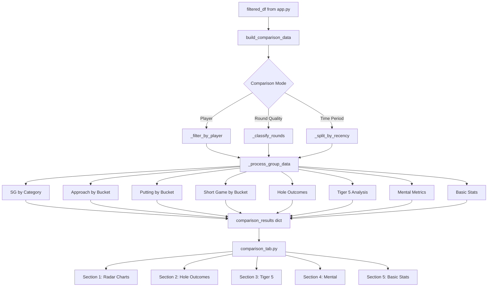

# Comparison Tab Implementation Plan

## Overview
Add a new "Comparison" tab to the golf dashboard that enables coaches to compare performance metrics across different dimensions:
- Player vs Player
- Round Quality (Under Par vs Par to +3 vs +4+)
- Time Period (Recent N rounds vs Previous N rounds)

## Comparison Modes

### Mode 1: Player vs Player
- Dropdown to select Player A (Group 1 - Blue)
- Dropdown to select Player B (Group 2 - Orange)
- All metrics computed separately for each player's data within filters

### Mode 2: Round Quality
- **Group 1 - Under Par**: Rounds where total score < 0 relative to par (great rounds)
- **Group 2 - Par to +3**: Rounds where total score is 0 to +3 (average rounds)
- **Group 3 - +4+**: Rounds where total score is +4 or worse (poor rounds)
- Users can toggle which 2 groups to compare (e.g., Under Par vs +4+)

### Mode 3: Time Period
- User-configurable number of rounds for each period
- **Group 1 - Recent**: Most recent N rounds (user input)
- **Group 2 - Previous**: N rounds before that (user input)
- Sorted by date within filtered data

## Data Flow Architecture

```
┌─────────────────────────────────────────────────────────────────┐
│                    app.py (filtering layer)                      │
├─────────────────────────────────────────────────────────────────┤
│  filtered_df → build_comparison_data(filtered_df, mode, params) │
│                      ↓                                          │
│              comparison_engine.py                                │
│                      ↓                                          │
│          comparison_results dict → comparison_tab.py             │
└─────────────────────────────────────────────────────────────────┘
```

## Implementation Steps

### Step 1: Create `engines/comparison.py`
Core data processing engine with functions:

#### Main Engine Function
```python
def build_comparison_data(filtered_df, mode, mode_params):
    """
    Build comparison data for the selected mode.
    
    Args:
        filtered_df: Full filtered DataFrame
        mode: 'player', 'round_quality', or 'time_period'
        mode_params: dict with mode-specific parameters
    
    Returns:
        comparison_results dict with all metrics for both groups
    """
```

#### Group Processing Functions
```python
def _process_group_data(df, group_name):
    """Process raw data for a single group and return all metrics."""
```

#### SG Category Aggregation
```python
def _compute_sg_by_category(df):
    """Return dict: {'Driving': sg_val, 'Approach': sg_val, ...}"""
```

#### Approach by Distance Buckets
```python
def _compute_approach_by_bucket(df):
    """Return dict: {'50-100': sg_val, '100-150': sg_val, ...}"""
```

#### Putting by Distance Buckets
```python
def _compute_putting_by_bucket(df):
    """Return dict: {'<5': sg_val, '5-10': sg_val, '10-20': sg_val, ...}"""
```

#### Short Game by Distance Buckets
```python
def _compute_short_game_by_bucket(df):
    """Return dict: {'<10': sg_val, '10-20': sg_val, ...}"""
```

#### Hole Outcome Distribution
```python
def _compute_hole_outcomes(df):
    """Return dict: {'Eagle': count, 'Birdie': count, 'Par': count, ...}"""
```

#### Tiger 5 Analysis
```python
def _compute_tiger5_summary(df, hole_summary):
    """Return dict with Tiger 5 counts and root causes per group."""
```

#### Mental Metrics
```python
def _compute_mental_metrics(df, hole_summary):
    """Return dict: {'bounce_back': %, 'gas_pedal': %, ...}"""
```

#### Basic Stats
```python
def _compute_basic_stats(df):
    """Return dict: {'fw_pct': %, 'gir_pct': %, 'penalties': count}"""
```

#### Round Quality Classification
```python
def _classify_rounds(hole_summary):
    """Classify each round as Under Par, Par to +3, or +4+."""
```

### Step 2: Create `tabs/comparison.py`
Tab rendering with 5 main sections:

#### Section 1: Comparison Mode Selector
```python
def render_comparison_selector():
    """Dropdown for mode selection with mode-specific controls."""
```

#### Section 2: Radar Charts (4 charts)
```python
def render_radar_charts(comparison_data):
    """Render 4 radar charts comparing two groups."""
```
- **Chart 2a**: Major SG Categories (Driving, Approach, Short Game, Putting)
- **Chart 2b**: Approach by Distance (50-100, 100-150, 150-200, 200+)
- **Chart 2c**: Putting by Distance (<5, 5-10, 10-20, 20-30, 30+)
- **Chart 2d**: Short Game by Distance (<10, 10-20, 20-30, 30-40, 40-50)

Each radar chart shows Group 1 (e.g., Blue) vs Group 2 (e.g., Orange) with overlapping traces.

#### Section 3: Hole Outcome Distribution
```python
def render_hole_outcomes(comparison_data):
    """Grouped bar chart: Eagles, Birdies, Pars, Bogeys, Double+."""
```
Side-by-side bars for Group 1 vs Group 2 with counts and percentages.

#### Section 4: Tiger 5 Comparison
```python
def render_tiger5_comparison(comparison_data):
    """Tiger 5 total counts and root cause breakdown."""
```
- Total Tiger 5 fails per group (bar chart)
- Root cause stacked bar (Driving, Approach, Short Game, Putting)

#### Section 5: Mental Characteristics & Round Flow
```python
def render_mental_comparison(comparison_data):
    """Comparison of bounce back, gas pedal, bogey train, etc."""
```
- Bounce Back Rate (%)
- Drop Off Rate (%)
- Gas Pedal Rate (%)
- Bogey Train Rate (%)

#### Section 6: Basic Stats Summary
```python
def render_basic_stats(comparison_data):
    """FW%, GIR%, Penalties comparison."""
```
3 stat cards per group side-by-side.

### Step 3: Update `app.py`
Add comparison tab to the main dispatch:
```python
from tabs.comparison import comparison_tab

# In tabs section:
tab_comparison = st.tabs([..., "Comparison"])

with tab_comparison:
    comparison_tab(filtered_df, hole_summary)
```

### Step 4: Update `ui/theme.py`
Add comparison-specific colors:
```python
# Comparison group colors (premium dark palette)
COMPARISON_GROUP_1 = "#4A1D7C"   # Deep Dark Purple
COMPARISON_GROUP_1_BG = "#4A1D7C40"  # 25% opacity for filled areas
COMPARISON_GROUP_2 = "#8B8B8B"   # Medium Light Charcoal Gray
COMPARISON_GROUP_2_BG = "#8B8B8B40"  # 25% opacity for filled areas

# Also add to CHART_PALETTE
CHART_PALETTE = [
    "#4A1D7C",  # Deep Dark Purple (comparison group 1)
    "#8B8B8B",  # Medium Charcoal Gray (comparison group 2)
    "#3D5A3E",  # deep forest green — primary accent
    "#8B6F47",  # warm brown (approach)
    "#2D6A4F",  # forest green (short game)
    "#7C6F9B",  # muted violet (putting)
    "#C53030",  # muted red (fail/recovery)
    "#B7791F",  # muted amber (secondary)
]
```

### Step 5: Update `ui/components.py`
Add comparison-specific components:
```python
def radar_chart(data, group1_name, group2_name, colors):
    """Render a radar chart with two groups overlaid."""
    # Uses Plotly polar chart
    # Group 1 filled area, Group 2 outline

def comparison_stat_card(label, group1_value, group2_value, unit="", 
                         group1_color=COMPARISON_GROUP_1, 
                         group2_color=COMPARISON_GROUP_2):
    """Side-by-side stat card for comparison."""

def grouped_bar_chart(labels, group1_values, group2_values, 
                      group1_name, group2_name, colors):
    """Render grouped bar chart for comparison."""
```

## Mermaid: Data Flow Diagram



## UI Layout Wireframe

```
┌──────────────────────────────────────────────────────────────┐
│  COMPARISON TAB                                              │
├──────────────────────────────────────────────────────────────┤
│  ┌─────────────────────────────────────────────────────────┐ │
│  │ Mode: [Player vs Player ▼]                              │ │
│  │ Player A: [Player 1 ▼]  Player B: [Player 2 ▼]          │ │
│  └─────────────────────────────────────────────────────────┘ │
├──────────────────────────────────────────────────────────────┤
│  SECTION 1: RADAR CHARTS                                    │
│  ┌─────────────┐ ┌─────────────┐                           │
│  │ SG Categories│ │ Approach    │                           │
│  │    Radar    │ │ by Distance │                           │
│  │ (4 axes)    │ │  Radar      │                           │
│  └─────────────┘ └─────────────┘                           │
│  ┌─────────────┐ ┌─────────────┐                           │
│  │  Putting    │ │ Short Game  │                           │
│  │    Radar    │ │  Radar      │                           │
│  └─────────────┘ └─────────────┘                           │
├──────────────────────────────────────────────────────────────┤
│  SECTION 2: HOLE OUTCOMES                                   │
│  ┌───────────────────────────────────────────────────────┐  │
│  │ Grouped Bar Chart: Eagle | Birdie | Par | Bogey | DB+ │  │
│  │   Blue ████████    Orange ██████████                   │  │
│  └───────────────────────────────────────────────────────┘  │
├──────────────────────────────────────────────────────────────┤
│  SECTION 3: TIGER 5 COMPARISON                              │
│  ┌──────────────────────┐ ┌──────────────────────────────┐  │
│  │ Total Tiger 5 Fails  │ │ Root Cause Breakdown         │  │
│  │ (Grouped Bar)        │ │ (Stacked Bar)                │  │
│  └──────────────────────┘ └──────────────────────────────┘  │
├──────────────────────────────────────────────────────────────┤
│  SECTION 4: MENTAL CHARACTERISTICS                          │
│  ┌─────────────────────────────────────────────────────────┐ │
│  │ Bounce Back │ Gas Pedal │ Bogey Train │ Mistake Penalty │ │
│  │   Blue: 22% │ Blue: 28% │ Blue: 35%  │ Blue: +0.15      │ │
│  │ Orange: 18% │ Orange: 22%│ Orange: 42%│ Orange: +0.32   │ │
│  └─────────────────────────────────────────────────────────┘ │
├──────────────────────────────────────────────────────────────┤
│  SECTION 5: BASIC STATS                                     │
│  ┌─────────────────────────────────────────────────────────┐ │
│  │ FW%     │ GIR%     │ Penalties │ Scrambling │ Sand Save│ │
│  │ Blue: 62%│ Blue: 67%│ Blue: 3   │ Blue: 45%  │ Blue: 52%│ │
│  │Orange: 55%│Orange: 58%│Orange: 7 │Orange: 38% │Orange: 41%│ │
│  └─────────────────────────────────────────────────────────┘ │
└──────────────────────────────────────────────────────────────┘
```

## Key Technical Considerations

### 1. Handling Missing Data
- If a group has no data for a metric, show "-" or 0 with a warning
- Radar charts should gracefully handle missing categories
- Use `fillna(0)` for SG calculations where appropriate

### 2. Round Quality Classification Logic
```python
def _classify_rounds(hole_summary):
    """Classify rounds into quality tiers."""
    round_scores = hole_summary.groupby('Round ID').agg({
        'Hole Score': 'sum',
        'Par': 'sum'
    })
    round_scores['Score vs Par'] = round_scores['Hole Score'] - round_scores['Par']
    
    def classify(score_vs_par):
        if score_vs_par < 0:
            return 'Under Par'
        elif score_vs_par <= 3:
            return 'Par to +3'
        else:
            return '+4+'
    
    return round_scores['Score vs Par'].apply(classify)
```

### 3. Time Period Split Logic
```python
def _split_by_recency(df, num_recent, num_previous):
    """Split rounds by recency."""
    round_dates = df.groupby('Round ID')['Date'].first().sort_values()
    recent_rounds = round_dates.tail(num_recent).index
    previous_rounds = round_dates.iloc[-num_recent-num_previous:-num_recent].index
    return recent_rounds, previous_rounds
```

### 4. Radar Chart Implementation (Plotly)
```python
def create_radar_chart(categories, group1_values, group2_values):
    """Create Plotly radar chart."""
    fig = go.Figure()
    
    fig.add_trace(go.Scatterpolar(
        r=group1_values,
        theta=categories,
        fill='toself',
        name='Group 1',
        line_color=COMPARISON_GROUP_1,
        fillcolor=COMPARISON_GROUP_1 + '40'  # 25% opacity
    ))
    
    fig.add_trace(go.Scatterpolar(
        r=group2_values,
        theta=categories,
        fill='toself',
        name='Group 2',
        line_color=COMPARISON_GROUP_2,
        fillcolor=COMPARISON_GROUP_2 + '40'
    ))
    
    fig.update_polars(...)
    return fig
```

### 5. Reusing Existing Engine Functions
The comparison engine should leverage existing engines where possible:
- `engines/strokes_gained.py`: SG calculations
- `engines/tiger5.py`: Tiger 5 analysis
- `engines/coachs_corner.py`: Mental metrics
- `engines/hole_summary.py`: Hole outcomes

Example:
```python
from engines.tiger5 import build_tiger5_results

def _compute_tiger5_for_group(df, hole_summary):
    """Wrapper around existing tiger5 engine."""
    results, total_fails, grit_score = build_tiger5_results(df, hole_summary)
    return {
        'total_fails': total_fails,
        'grit_score': grit_score,
        'by_category': results
    }
```

## File Structure

```
golf-dashboard-master/
├── app.py                          # Updated to include comparison tab
├── engines/
│   ├── comparison.py               # NEW: Main comparison engine
│   ├── driving.py
│   ├── approach.py
│   ├── short_game.py
│   ├── putting.py
│   ├── tiger5.py
│   ├── coachs_corner.py
│   └── ...
├── tabs/
│   ├── comparison.py               # NEW: Comparison tab renderer
│   ├── coachs_corner.py
│   └── ...
├── ui/
│   ├── components.py               # Updated with comparison components
│   ├── theme.py                    # Updated with comparison colors
│   ├── chart_config.py
│   └── ...
└── ...
```

## Success Criteria

1. ✅ All three comparison modes work correctly (Player, Round Quality, Time Period)
2. ✅ Radar charts render with proper axis labels and two-group comparison
3. ✅ Hole outcomes show clear bar chart comparison
4. ✅ Tiger 5 comparison shows both totals and root causes
5. ✅ Mental metrics are computed and displayed per group
6. ✅ Basic stats (FW%, GIR%, Penalties) are shown side-by-side
7. ✅ Color scheme is consistent with existing theme (Blue/Orange for comparison)
8. ✅ No breaking changes to existing tabs
